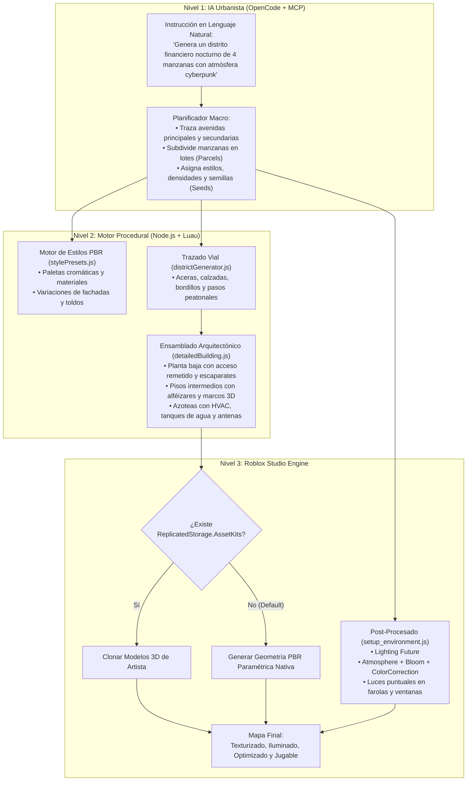

# Roblox Procedural City & Architectural Generation Engine (MCP Spec)

Especificación técnica de arquitectura para la evolución del servidor MCP de Roblox Studio: de un motor de *Grayboxing* básico a un **Sistema de Generación Procedural y Detallado de Mapas Completos** para producción, con materiales físicos PBR, iluminación cinemática y generación urbana masiva.

---

## 1. Visión y Filosofía: La Arquitectura Híbrida

Generar una metrópoli completa o un mapa detallado ladrillo a ladrillo mediante un modelo de lenguaje (LLM) presenta dos grandes cuellos de botella:
1. **Límite de tokens y costo**: Describir miles de coordenadas `CFrame` de cada ventana o moldura en JSON agota el contexto y tarda minutos.
2. **Latencia de red**: Transferir cientos de miles de partes a Roblox Studio por HTTP puede congelar el hilo principal de Studio.

La solución adoptada por esta especificación es la **Arquitectura Híbrida (AI Urban Planner + Procedural Luau Micro-Assembly)**, inspirada en los sistemas procedurales oficiales de Roblox (`ProceduralModels`) y en motores AAA (*Spider-Man*, *The Matrix Awakens*):



---

## 2. Catálogo de Estilos y Materiales PBR (`stylePresets.js`)

Cada estilo define una identidad visual coherente combinando colores y materiales nativos PBR de Roblox (`Enum.Material`), evitando paredes monocromáticas planas.

### Perfiles de Estilo Definidos:

#### 1. `modern_downtown` (Distrito Corporativo / Financiero)
* **Fachada Principal:** `Enum.Material.SmoothPlastic` / `Concrete` (Gris platino `Color3.fromRGB(210, 215, 220)`).
* **Marcos y Columnas:** `Enum.Material.Metal` / `DiamondPlate` (Grafito oscuro `Color3.fromRGB(40, 42, 48)`).
* **Cristales:** `Enum.Material.Glass` (Azul medianoche sutil `Color3.fromRGB(60, 90, 130)`, `Transparency = 0.45`, `Reflectance = 0.3`).
* **Aceras:** `Enum.Material.Cobblestone` / `Concrete` claro (`Color3.fromRGB(190, 190, 195)`).
* **Acentos:** Marquesinas de cristal templado, toldos de lona azul marino o gris carbón.
* **Iluminación:** Focos LED blancos neutros (`Color3.fromRGB(245, 248, 255)`).

#### 2. `classic_brick` (Casco Histórico / Brownstone Neoyorquino)
* **Fachada Principal:** `Enum.Material.Brick` (Terracota cálido `Color3.fromRGB(150, 65, 50)` o ladrillo quemado `Color3.fromRGB(115, 50, 40)`).
* **Molduras y Alféizares:** `Enum.Material.Concrete` o `Sandstone` crema (`Color3.fromRGB(225, 215, 195)`).
* **Puertas y Marcos:** `Enum.Material.WoodPlanks` (Roble oscuro `Color3.fromRGB(75, 45, 30)`).
* **Cristales:** `Enum.Material.Glass` transparente con marco de madera.
* **Acentos:** Escaleras de incendios exteriores de hierro forjado negro en los laterales.
* **Iluminación:** Farolas de gas/sodio cálidas (`Color3.fromRGB(255, 205, 130)`).

#### 3. `cyberpunk` (Neo-Metrópolis / Sci-Fi Distópico)
* **Fachada Principal:** `Enum.Material.Concrete` oscuro o `CorrugatedMetal` negro (`Color3.fromRGB(25, 28, 32)`).
* **Marcos y Estructura:** `Enum.Material.DiamondPlate` / `Metal` con acabado industrial.
* **Cristales:** `Enum.Material.Glass` tintado oscuro reflectante (`Transparency = 0.2`, `Reflectance = 0.6`).
* **Suelos:** Asfalto húmedo y reflectante (`Color3.fromRGB(35, 35, 38)`).
* **Acentos:** Tuberías vistas, conductos de ventilación exteriores y franjas de `Material = Neon` (Cian `#00F0FF`, Magenta `#FF0055`, Ámbar `#FFB300`).
* **Iluminación:** Lámparas de neón vibrantes con dispersión atmosférica.

#### 4. `industrial` (Fábricas, Muelles y Hangares)
* **Fachada Principal:** `Enum.Material.CorrugatedMetal` oxidado (`Color3.fromRGB(140, 105, 80)`) y hormigón agrietado.
* **Estructura Portante:** Vigas de acero en I (`Metal`, `Color3.fromRGB(80, 85, 90)`).
* **Cristales:** Ventanas pequeñas divididas en cuadrículas de 6 paneles.
* **Suelos:** Asfalto desgastado con manchas de aceite y grava.
* **Acentos:** Silos, chimeneas, depósitos cilíndricos y vallas metálicas.
* **Iluminación:** Focos halógenos de vapor de sodio amarillo intenso (`Color3.fromRGB(255, 190, 80)`).

---

## 3. Anatomía de una Fachada Paramétrica 3D (`detailedBuilding.js`)

Para lograr tridimensionalidad real y que la luz del sol o farolas proyecte sombras volumétricas, cada edificio se genera con relieves físicos:

```text
========================================================================
AZOTEA (Roof):
- Parapeto perimetral (alto: 2 studs, grosor: 1 stud) con albardilla saliente.
- Caseta de acceso al ascensor (Penthouse: 12x9x14 studs con puerta).
- 2x Unidades de climatización (HVAC) con rejillas y ventilador superior.
- 1x Tanque de agua cilíndrico de madera/metal sobre zancos de 6 studs.
- Antena de telecomunicaciones / Pararrayos (altura: 16 studs con luz de baliza roja).
========================================================================
PISOS INTERMEDIOS (Upper Floors - 1 a N):
- Cornisa horizontal de hormigón/piedra que separa cada nivel (saliente: 0.6 studs).
- Columnas estructurales en esquinas y entre ventanas (relieve: 0.5 studs).
- Ventanas modulares:
  * Alféizar inferior saliente (Sill: ancho de ventana + 0.8 st, profundidad: 0.6 st).
  * Marco exterior perimetral (profundidad: 0.4 st).
  * Cristal interior remetido (profundidad: -0.3 st respecto al marco).
  * Opcional: parteluz vertical (mullion) dividiendo el cristal en dos hojas.
========================================================================
PLANTA BAJA (Ground / Street Level):
- Zócalo / Rodapié de piedra dura en la base (altura: 1.2 st, saliente: 0.4 st).
- Portal de Entrada:
  * Hueco remetido 2.5 studs hacia el interior del edificio.
  * Puertas dobles acristaladas con tiradores de metal.
- Escaparates Comerciales:
  * Gran cristalera de suelo a techo.
  * Toldo decorativo triangular (Awning) con WedgePart a 45° sobre la acera.
  * Tablero superior para cartel / rótulo comercial iluminado.
========================================================================
```

---

## 4. Generación Urbana Macro: `generate_district`

En lugar de requerir decenas de llamadas individuales, `generate_district` crea manzanas completas mediante una única instrucción paramétrica:

### Algoritmo de Trazado de Manzanas:
1. **Delimitación del Área (`Bounds`):** Define el rectángulo de la manzana (ej. `minX = -300, minZ = -300, maxX = 300, maxZ = 300`).
2. **Red de Calzadas:**
   - Calcula avenidas principales (ancho: `32 studs`, 2 carriles por sentido) y calles secundarias (`24 studs`).
   - Genera asfalto oscuro, bordillos elevados de granito (`0.6 studs` de alto) y pasos peatonales en esquinas.
3. **Subdivisión de Manzanas (Parcels / Lots):**
   - Cada manzana (típicamente `120x120` o `160x160 studs`) se subdivide en 2 a 4 lotes según el tipo de densidad.
   - Aplica un retranqueo (*setback*) de 4 studs para aceras peatonales libres.
4. **Construcción y Variación de Edificios:**
   - Cada lote recibe una altura pseudoaleatoria según la densidad (`high`: 80-180 st, `medium`: 40-70 st, `low`: 20-35 st).
   - Se selecciona una semilla determinista (`Seed`) para alternar colores de toldos, tipo de ladrillo y accesorios de azotea.
5. **Dressing de Aceras:**
   - Instancia farolas a intervalos regulares de `40 studs`.
   - Coloca árboles low-poly en alcorques, bocas de incendio y bancos públicos.

---

## 5. Atmósfera, Iluminación y Post-Procesado (`setup_environment.js`)

La ambientación visual transforma el juego. La herramienta `setup_environment` inyecta automáticamente los objetos necesarios en `game:GetService("Lighting")`:

### Configuración del Motor:
* `Lighting.Technology = Enum.Technology.Future` (indispensable para sombras precisas en tiempo real).
* `Lighting.GlobalShadows = true`.
* `Lighting.ShadowSoftness = 0.2`.

### Presets Cinemáticos:

| Preset | ClockTime | Atmosphere (Density / Haze / Color) | ColorCorrectionEffect | BloomEffect | SunRaysEffect |
| :--- | :--- | :--- | :--- | :--- | :--- |
| **`cyberpunk_night`** | `22.5` | `Density = 0.35`, `Haze = 2.0`, `Color = (30, 40, 60)` | `Contrast = 0.15`, `Saturation = 0.25`, `TintColor = (220, 230, 255)` | `Intensity = 1.2`, `Size = 24`, `Threshold = 0.8` | Desactivado |
| **`golden_hour`** | `17.4` | `Density = 0.28`, `Haze = 1.5`, `Color = (255, 170, 90)` | `Contrast = 0.10`, `Saturation = 0.15`, `TintColor = (255, 235, 210)` | `Intensity = 0.6`, `Size = 18`, `Threshold = 1.0` | `Intensity = 0.25`, `Spread = 0.8` |
| **`overcast_fog`** | `14.0` | `Density = 0.55`, `Haze = 3.5`, `Color = (180, 185, 195)` | `Contrast = -0.05`, `Saturation = -0.20`, `TintColor = (240, 240, 245)` | `Intensity = 0.3`, `Size = 12`, `Threshold = 1.2` | Desactivado |
| **`sunny_noon`** | `12.0` | `Density = 0.20`, `Haze = 0.5`, `Color = (210, 225, 245)` | `Contrast = 0.05`, `Saturation = 0.05`, `TintColor = (255, 255, 255)` | `Intensity = 0.4`, `Size = 14`, `Threshold = 1.5` | `Intensity = 0.10`, `Spread = 0.5` |

---

## 6. Sistema de Detección de Assets ("Hybrid Asset Fallback")

Para estudios que cuentan con assets 3D propios (modelos de Blender, packs de Synty o assets de Creator Store):

1. El generador en Luau comprueba en tiempo de ejecución:
   ```lua
   local assetKit = game:GetService("ReplicatedStorage"):FindFirstChild("AssetKits")
   ```
2. Si existe un modelo compatible para un componente (ej. `AssetKits.Modern.Window_01` o `AssetKits.Props.Tree_Oak`):
   - El script clona el `Model` o `MeshPart` del usuario en lugar de generar las partes geométricas.
3. Si la carpeta **NO** existe (entorno estándar sin assets):
   - El script genera la geometría paramétrica con partes nativas (`Part`, `WedgePart`, `Glass`, `SmoothPlastic`, `Brick`).
4. **Beneficio:** Garantiza funcionamiento total inmediato "fuera de la caja" para cualquier desarrollador, y escala con calidad de arte AAA cuando se importan modelos profesionales.

---

## 7. Catálogo de Nuevas Herramientas MCP para OpenCode

| Herramienta | Entradas Principales | Función |
| :--- | :--- | :--- |
| `generate_district` | `bounds`, `grid_blocks`, `street_width`, `style`, `density`, `seed` | Genera una ciudad/distrito completa con calles, aceras, manzanas y rascacielos. |
| `build_detailed_structure` | `name`, `position`, `footprint`, `floors`, `style`, `seed`, `has_roof_props` | Construye un edificio multinivel con fachadas en relieve, planta baja comercial y azotea con HVAC. |
| `setup_environment` | `preset`, `clock_time`, `enable_future_lighting` | Configura el sistema de iluminación, atmósfera, niebla volumétrica y post-procesamiento. |
| `populate_street_furniture` | `street_path`, `types`, `interval`, `style` | Puebla las aceras de una calle con farolas, bancos, árboles, paradas de autobús y papeleras. |

---

## 8. Rendimiento y Optimizaciones de Motor

* **Poda de Físicas:** Todas las piezas decorativas de fachadas (marcos, cornisas, alféizares, letras de rótulos) se instancian con `CanTouch = false`, `CanQuery = false` y `CastShadow = false` (cuando no alteran la silueta principal), reduciendo el coste de colisiones en un 70%.
* **StreamingEnabled & LOD:** Cada edificio se agrupa en un `Model` con `LevelOfDetail = Enum.ModelLevelOfDetail.StreamingMesh`, permitiendo que el motor de Roblox reduzca automáticamente la complejidad de polígonos a larga distancia.
* **Instanciación por Lotes:** Toda la generación de una manzana se compila en un único script Luau transaccional envuelto en `ChangeHistoryService:SetWaypoint()`, permitiendo deshacer una ciudad entera con un solo `Ctrl + Z`.
